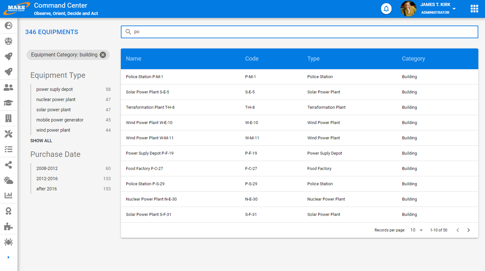

# Recherche

La recherche full-text à facette est un excellent moyen d'accès à l'information. Il est à la fois très performant d'un point de vue technique mais également très ergonomique et c'est pour ces raisons que nous invitons tous les concepteurs d'applications à l'utiliser.

Ce type d'écran est rencontré assez fréquement sur des sites grand public, les utilisateurs y sont parfaitement habitués.

Un écran de ce type est composé de trois grandes zones :

- une barre de recherche textuelle qui permet à l'utilisateur de saisir ses critères de recherche
- une liste de facettes qui permettent de filter facilement les éléments, cette zone présente à la fois les critères selectionnés et ceux qui peuvent être ajoutés pour réduire le nombre de résultats et trouver l'information que l'on souhaite
- les résultat en eux même, voir [ici](/design-system/organismes/collections) pour plus d'information sur les types de représentation possibles

Ce type d'écran permet une forte intéractivité avec l'utilisateur car les résultats sont automatiquement mis à jour en temps réél lorsqu'il précise sa recherche via le texte ou les facettes.

# Bonnes pratiques

- N'affichez pas toutes les valeurs possibles des facettes mais n'en affichez qu'une dizaine, les autres doivent être disponibles en cliquant sur un bouton de type "voir plus"
- Affichez en haut de l'écran le nombre total d'éléments qui correspondent aux critère de recherche appliqués, cela donne une indication précieuse à l'utilisateur pour l'affiner

# Design

 
