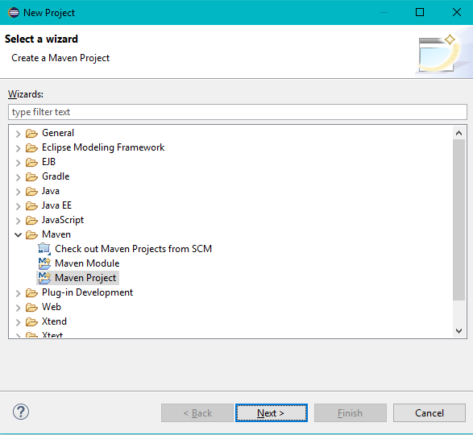
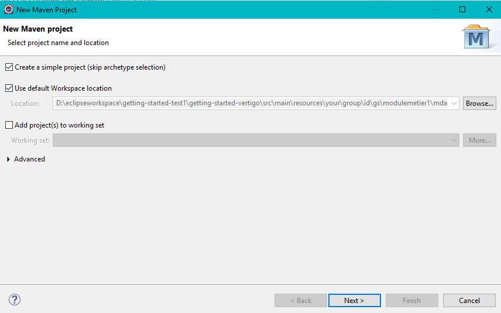
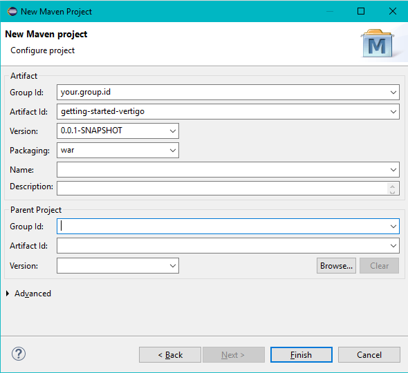
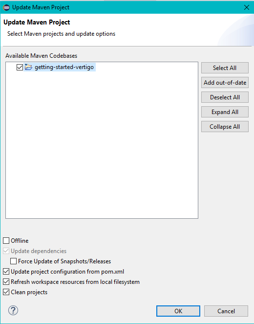
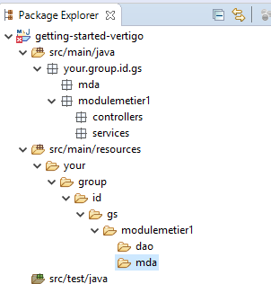
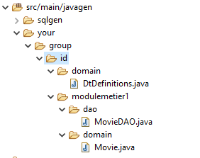
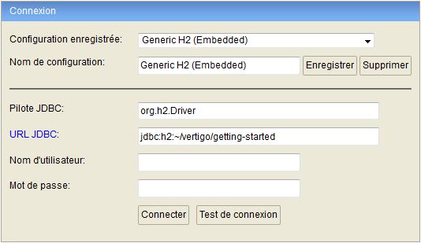
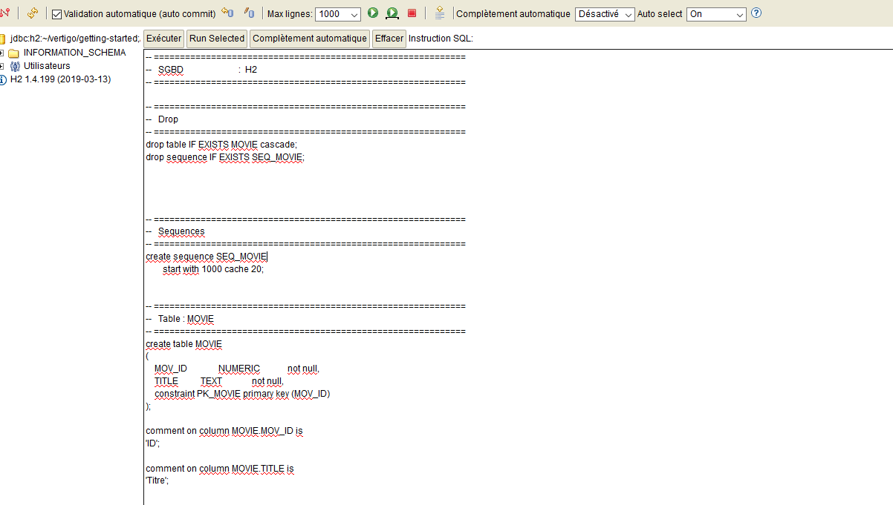

# Application complète (Real world Hello World !)

## Création du projet dans l'IDE

Nous utiliserons ici Eclipse. A l'heure de la rédaction de ce guide, la version utilisée est la 2018-09.


### 1. Création du projet Java (méthode 1 : sans archétype Maven)

Cliquer sur __File > New > Project__. Dans la boîte de dialogue, choisir __Maven > Maven Project__ et cliquer sur __Next__.



Dans l'écran "Select project name and location", cocher l'option _Create a simple project (skip archetype selection)_ et cliquer sur __Next__.



Dans "Configure project", renseigner les champs suivants :
* Group ID : your.group.id (ou autre chose de plus signifiant pour vous !)
* Artifact ID : getting-started-vertigo
* Packaging : War

Cliquer sur __Finish__.



### 2. Configuration du fichier pom du projet

Ouvrir le fichier __pom.xml__ à la racine du projet.

Rajouter les propriétés permettant de spécifier la version de Java (ici 1.8) ainsi que l'encodage des fichiers à utiliser.

Rajouter les dépendances suivantes dans le fichier pom.xml : 
* Module vertigo-ui (cette dépendance tirera l'ensemble des modules Vertigo requis pour l'application)
* Module vertigo-studio (celui-ci nous simplifie la tâche en générant des parties de code sans valeur ajoutée)
* Les dépendances externes vers des outils nécessaires : 
  * La dépendance `provided` à l'API servlet 3.1 ou supérieure
  * Une base de données H2 (il s'agit d'une base mémoire, facile à utiliser à des fins de tests)
  * Le gestionnaire de pool de connexions C3P0 pour la connexion à la base de données

Rajouter l'indication que le répertoire contenant les fichiers générés (src/main/javagen) doit faire partie du "Build Path" d'Eclipse.
	
Le fichier pom.xml devrait maintenant ressembler à ceci : 

```xml
<project xmlns="http://maven.apache.org/POM/4.0.0" xmlns:xsi="http://www.w3.org/2001/XMLSchema-instance" xsi:schemaLocation="http://maven.apache.org/POM/4.0.0 http://maven.apache.org/xsd/maven-4.0.0.xsd">
	<modelVersion>4.0.0</modelVersion>
	<groupId>your.group.id</groupId>
	<artifactId>getting-started-vertigo</artifactId>
	<version>0.0.1-SNAPSHOT</version>
	<packaging>war</packaging>
	
	<properties>
		<maven.compiler.source>1.8</maven.compiler.source>
		<maven.compiler.target>1.8</maven.compiler.target>
		<project.build.sourceEncoding>UTF-8</project.build.sourceEncoding>
	</properties>
	
	<dependencies>
		<dependency>
			<groupId>javax.servlet</groupId>
			<artifactId>javax.servlet-api</artifactId>
			<version>3.1.0</version>
			<scope>provided</scope>
		</dependency>
		<dependency>
			<groupId>io.vertigo</groupId>
			<artifactId>vertigo-ui</artifactId>
			<version>2.0.0</version>
		</dependency>
		<dependency>
			<groupId>io.vertigo</groupId>
			<artifactId>vertigo-studio</artifactId>
			<version>2.0.0</version>
		</dependency>
		<dependency>
			<groupId>com.h2database</groupId>
			<artifactId>h2</artifactId>
			<version>1.4.199</version>
		</dependency>
		<dependency>
			<groupId>com.mchange</groupId>
			<artifactId>c3p0</artifactId>
			<version>0.9.5.3</version>
		</dependency>
	</dependencies>
	
	
	<build>
		<plugins>
			<plugin>
				<groupId>org.codehaus.mojo</groupId>
				<artifactId>build-helper-maven-plugin</artifactId>
				<executions>
					<execution>
						<phase>generate-sources</phase>
						<goals>
							<goal>add-source</goal>
						</goals>
						<configuration>
							<sources>
								<source>src/main/javagen</source>
							</sources>
						</configuration>
					</execution>
				</executions>
			</plugin>
		</plugins>
	</build>
	
</project>
```

Une fois le fichier pom.xml complété, cliquer avec le bouton de droite sur le projet getting-started-vertigo puis sur __Maven > Update Project__.
Dans la boîte de dialogue, vérifier que les éléments suivants sont cochés :
* Update project configuration from pom.xml
* Refresh workspace resources from local filesystem
* Clean projects

Cliquer sur __OK__.



### 3. Création de la structure du projet

Créer l'arborescence de packages et de répertoires suivante :



## Phase de modélisation

Nous allons ici créer la description des entités métier de l'application. Cette description sera utilisée par l'outil _vertigo-studio_ pour créer les classes Java correspondantes ainsi que les classes d'accès aux données.

### 1. Créer un fichier __modele.ksp__ dans le répertoire __/src/main/resources/your/group/id/gs/modulemetier1/mda__

Dans ce fichier, insérer les éléments suivants:

```json
package your.group.id.gs.modulemetier1.domain 

/* Formatteur de données par défaut */
create Formatter FmtDefault {
	className: "io.vertigo.dynamox.domain.formatter.FormatterDefault"
}

/* Domaines représentant les types de données utilisables dans les entités */
create Domain DoId {
	dataType: Long
	formatter: FmtDefault
	storeType: "NUMERIC"
}

create Domain DoLabel {
	dataType:String
	formatter: FmtDefault
	storeType: "TEXT"
}

/* Description d'une entité métier représentant un film et son titre */
create DtDefinition DtMovie {
	id movId {domain: DoId label: "ID"}
	field title {domain: DoLabel label: "Titre" required: "true"  }
}
```

### 2. Créer un fichier __run.kpr__ dans le répertoire __src/main/resources/your/group/id/gs/modulemetier1/__

Ce fichier contient la ligne suivante, indiquant que le fichier à utiliser pour la génération des classes est le fichier ksp créé ci-dessus

```json
mda/modele.ksp
```

### 3. Créer une classe nommée __Studio__ dans le package __your/group/id/gs/mda/__

Cette classe comprend l'ensemble des instructions permettant de générer les classes Java et les DAO correspondant aux entités métier à partir des fichiers KSP pointés par le fichier KPR.

Copier le code suivant dans la classe Studio : 

```java
package your.group.id.gs.mda;

import io.vertigo.app.AutoCloseableApp;
import io.vertigo.app.config.DefinitionProviderConfig;
import io.vertigo.app.config.ModuleConfig;
import io.vertigo.app.config.NodeConfig;
import io.vertigo.commons.CommonsFeatures;
import io.vertigo.core.param.Param;
import io.vertigo.core.plugins.resource.classpath.ClassPathResourceResolverPlugin;
import io.vertigo.dynamo.DynamoFeatures;
import io.vertigo.dynamo.plugins.environment.DynamoDefinitionProvider;
import io.vertigo.studio.StudioFeatures;
import io.vertigo.studio.mda.MdaManager;

public class Studio {

	// Méthode d'initialisation de la configuration de Studio
	private static NodeConfig buildNodeConfig() {
		return NodeConfig.builder() 									// Création d'un conteneur pour la configuration
				.beginBoot() 											// Debut de configuration du boot de l'application qui permet de spécifier les plugins des composants natifs (ParamManager et ResourcesManager)
				.addPlugin(ClassPathResourceResolverPlugin.class)		// Initialisation du resolveur de ressources via le classpath
				.endBoot()												// Le démarrage de vertigo-studio est terminé
				.addModule(new CommonsFeatures().build())				// Configuration des fonctions communes de Vertigo
				.addModule(new DynamoFeatures().build())				// Configuration des fonctions d'accès aux données
				//----Definitions
				.addModule(ModuleConfig.builder("ressources")			// Ajout des ressources pour la génération des classes Java
						.addDefinitionProvider(DefinitionProviderConfig.builder(DynamoDefinitionProvider.class)
								.addDefinitionResource("kpr", "your/group/id/gs/modulemetier1/run.kpr")
								.build())
						.build())
				// ---StudioFeature
				.addModule(new StudioFeatures()							// Configuration du moteur vertigo-Studio
						.withMasterData()
						.withMda(Param.of("projectPackageName", "your.group.id.gs"))
						.withJavaDomainGenerator(Param.of("generateDtResources", "false"))
						.withTaskGenerator()
						.withSqlDomainGenerator(
								Param.of("targetSubDir", "javagen/sqlgen"),
								Param.of("baseCible", "H2"), 
								Param.of("generateDrop", "true"),
								Param.of("generateMasterData", "true"))
						.build())
				.build();

	}

	
	// Méthode main à lancer pour générer les éléments du projet à partir du modèle 
	public static void main(String[] args) {
		// Création de l'application vertigo-studio avec la configuration ci-dessus
		try (final AutoCloseableApp app = new AutoCloseableApp(buildNodeConfig())) {	
			final MdaManager mdaManager = app.getComponentSpace().resolve(MdaManager.class);
			//-----
			// Nettoyage des générations précédentes
			mdaManager.clean();
			// Lancement de la génération
			mdaManager.generate().displayResultMessage(System.out);
		}
	}

}
```

> Attention le cas échéant à adapter le code pour correspondre à votre nom de package 

Sauvegarder, cliquer avec le bouton de droite sur le fichier __Studio.java__ puis sur __Run as > Java Application__.

La génération des fichiers est lancée et les entités générées apparaissent dans le répertoire __src/main/javagen/your/group/id__.

__Note__ : Sous Eclipse, il est nécessaire de raffraichir la liste des fichiers du projet pour les voir apparaître (Clic-droit sur le projet > Refresh).

Ces éléments sont maintenant utilisables pour créer des services puis des écrans.



### 4. Créer la base de données exemple

Nous allons ici créer la structure de la base de données correspondant au modèle créé précédemment.

Pour ce faire :
* Télécharger l'exécutable H2 : [ici](http://central.maven.org/maven2/com/h2database/h2/1.4.199/h2-1.4.199.jar)
* Double-cliquer sur le jar téléchargé
* Renseigner "URL JDBC", ici : 
  * `jdbc:h2:~/vertigo/getting-started;AUTO_SERVER=TRUE`
* Cliquer sur __Connecter__



* Copier / Coller le script SQL de création de la base de données (_src/main/javagen/sqlgen/crebas.sql_) dans la fenêtre de requête
* Cliquer sur __Exécuter__, la structure de la base est maintenant créée



* Cliquer sur le bouton __Déconnecter__


### 5. Configuration de l'application

Configurer notre application va se faire en deux étapes :

- Déclarer notre module métier en créant sa classe de manifeste
- Créer le fichier de configuration de notre application qui utilisera des modules de vertigo ainsi que notre module métier

Pour déclarer notre module métier, il suffit de créer la classe __ModuleMetier1Features__ avec le contenu suivant à la racine du package de notre module métier : __your.group.id.gs.modulemetier1__
Pour simplifier la configuration nous allons utiliser la découverte automatique des composants à partir d'un package racine en utilisant la classe `ModuleDiscoveryFeatures`


```java
package your.group.id.gs.modulemetier1;

import io.vertigo.app.config.DefinitionProviderConfig;
import io.vertigo.app.config.discovery.ModuleDiscoveryFeatures;
import io.vertigo.dynamo.plugins.environment.DynamoDefinitionProvider;

public class ModuleMetier1Features extends ModuleDiscoveryFeatures<ModuleMetier1Features> { // nous étendons ModuleDiscoveryFeatures pour activer la découverte automatique

	public ModuleMetier1Features() {
		super("ModuleMetier1"); // Nous donnons un nom signigiant à notre module métier
	}

	@Override
	protected void buildFeatures() {
		super.buildFeatures(); // découverte automatique de tous les composants
		getModuleConfigBuilder()
				.addDefinitionProvider(DefinitionProviderConfig.builder(DynamoDefinitionProvider.class)
						.addDefinitionResource("kpr", "your/group/id/gs/modulemetier1/run.kpr") // chargement de notre modèle de donnée
						.build());

	}

	@Override
	protected String getPackageRoot() {
		return this.getClass().getPackage().getName(); // nous utilisons la localisation de la classe de manisfeste comme racine du module
	}

}

```


Pour créer le fichier de configuration de l'application, créer un fichier `getting-started.yaml` dans le dossier __src/main/resources/your/group/id/gs/__ avec le contenu suivant : 

```yaml
---
boot:
  params:
    locales: fr_FR
  plugins:
    - io.vertigo.core.plugins.resource.classpath.ClassPathResourceResolverPlugin: {}
modules:
  io.vertigo.commons.CommonsFeatures: # utilisation du module vertigo-commons
    features:
      - script:
      - cache:
    featuresConfig:
      - script.janino:
      - cache.memory:
  io.vertigo.database.DatabaseFeatures: # utilisation du module vertigo-database pour pouvoir utiliser une base de données
    features:
      - sql: # nous activons le support des bases de données SQL
    featuresConfig:
      - sql.c3p0: # nous utilisons ici le pool de connection C3P0 pour récuperer les connections à la base
          dataBaseClass: io.vertigo.database.impl.sql.vendor.h2.H2DataBase
          jdbcDriver: org.h2.Driver
          jdbcUrl: jdbc:h2:~/vertigo/getting-started;AUTO_SERVER=TRUE
  io.vertigo.dynamo.DynamoFeatures: # utilisation du module vertigo-dynamo
    features:
      - store: # activation du support du stockage des entités de notre modèle
      - kvStore: # activation du support du stockage clé/valeur (utilisé pour la conservation des état de écrans)
    featuresConfig:
      - store.data.sql: # nous utilisons un store de type SQL (avec notre base H2)
      - kvStore.berkeley:  # nous utilisons un stockage clé valeur avec la base de donnée BerkeleyDB
          collections: VViewContext;TTL=43200
          dbFilePath: ${java.io.tmpdir}/vertigo-ui/VViewContext
  
  your.group.id.gs.modulemetier1.ModuleMetier1Features: # utilisation de notre module métier

```


## Créer un premier service métier

Dans cette section, nous allons créer les éléments (services utilisant les classes d'accès aux données) qui nous permettront ensuite de créer notre premier écran.

Le but sera de fournir un écran proposant d'enregistrer un film avec son titre dans la base de données, puis un écran de visualisation de la liste des films présents dans la base de données.

### 1. Création d'un service métier

Le service métier fournit des fonctionnalités de haut niveau concernant un concept métier donné. Dans ce guide, il s'agit de simples fonctions d'enregistrement et de lecture des entités (ici un "film").

Ce service comprendra les fonctions suivantes :
* Récupération de la liste de tous les films
* Récupération d'un film
* Enregistrement d'un film

Créer une classe nommmée `MovieServices` dans le package __your.group.id.gs.modulemetier1.services__

Copier / coller le contenu suivant dans la classe :

```java
package your.group.id.gs.modulemetier1.services;

import javax.inject.Inject;

import io.vertigo.commons.transaction.Transactional;
import io.vertigo.core.component.Component;
import io.vertigo.dynamo.criteria.Criterions;
import io.vertigo.dynamo.domain.model.DtList;
import io.vertigo.dynamo.domain.model.DtListState;
import io.vertigo.lang.Assertion;
import your.group.id.gs.modulemetier1.dao.MovieDAO;
import your.group.id.gs.modulemetier1.domain.Movie;

@Transactional
public class MovieServices implements Component {

	@Inject
	private MovieDAO movieDAO;

	public Movie getMovieById(final Long movId) {
		Assertion.checkNotNull(movId);
		//--- 
		return movieDAO.get(movId);
	}

	public DtList<Movie> getAllMovies() {
		return movieDAO.findAll(Criterions.alwaysTrue(), DtListState.of(100));
	}

	public Movie save(final Movie movie) {
		Assertion.checkNotNull(movie);
		//---
		return movieDAO.save(movie);
	}
}
```

Remarques :
* La classe implémente l'interface `Component`qui permet d'identifier les composants d'une application Vertigo
* L'annotation @Transactional permet de gérer le caractère transactionnel (base de données...) des services que l'on implémente.
* L'annotion @Inject permet de réaliser l'injection de dépendance, ici nous injectons le composant `MovieDAO` qui réalise l'accès aux données pour l'entité `Movie`.

## Créer les premiers écrans

### 1. Création de l'écran de détail d'un film

#### Création du contrôleur

Créer une classe `MovieDetailController` dans le package __your.group.id.gs.modulemetier1.controllers__

Copier / coller le code suivant dans la classe :

```java
package your.group.id.gs.modulemetier1.controllers;

import javax.inject.Inject;

import org.springframework.stereotype.Controller;
import org.springframework.web.bind.annotation.GetMapping;
import org.springframework.web.bind.annotation.PathVariable;
import org.springframework.web.bind.annotation.PostMapping;
import org.springframework.web.bind.annotation.RequestMapping;

import io.vertigo.ui.core.ViewContext;
import io.vertigo.ui.core.ViewContextKey;
import io.vertigo.ui.impl.springmvc.argumentresolvers.ViewAttribute;
import io.vertigo.ui.impl.springmvc.controller.AbstractVSpringMvcController;
import your.group.id.gs.modulemetier1.services.MovieServices;
import your.group.id.gs.modulemetier1.domain.Movie;

@Controller
@RequestMapping("/movie")
public class MovieDetailController extends AbstractVSpringMvcController {

	private static final ViewContextKey<Movie> movieKey = ViewContextKey.of("movie");

	@Inject
	private MovieServices movieServices;

	@GetMapping("/{movId}")
	public void initContext(final ViewContext viewContext, @PathVariable("movId") final Long movId) {
		viewContext.publishDto(movieKey, movieServices.getMovieById(movId));
		toModeReadOnly();
	}

	@GetMapping("/new")
	public void initContext(final ViewContext viewContext) {
		viewContext.publishDto(movieKey, new Movie());
		toModeCreate();
	}

	@PostMapping("/_edit")
	public void doEdit() {
		toModeEdit();
	}

	@PostMapping("/_save")
	public String doSave(@ViewAttribute("movie") final Movie movie) {
		movieServices.save(movie);
		return "redirect:/movie/" + movie.getMovId();
	}

}
```

> A noter : les contrôleurs vertigo-ui utilisent le module SpringMVC enrichi par Vertigo (la classe dérive de la classe AbstractVSpringMvcController).

#### Création de la vue

La vue est constituée par un fichier HTML se référant aux éléments servis par la classe contrôleur.

Ajouter un fichier __movieDetail.html__ dans le dossier __src/main/webapp/WEB-INF/views/modulemetier1__

> Afin de simplifier la vie du développeur nous préconisons un mapping 1 vue = 1 controller
> Dans ce même esprit de simplification le lien qui existe entre une vue et un controller est fait par convention de nommage en suivant le partern CoC (Convention Over Configuration)
> La stratégie de lien est la suivante : un controlleur `your.group.id.gs.modulemetier.controllers.NomController` sera lié à la vue `/modulemetier/nom.html` et un controller `your.group.id.gs.modulemetier.controllers.souspackage.NomController` à la vue `/modulemetier/souspackage/nom.html`

Dans ce fichier, copier / coller le code suivant:

```html
<!DOCTYPE html>
<html
	xmlns:th="http://www.thymeleaf.org" 
	xmlns:vu="http://www.morphbit.com/thymeleaf/component">
	<head>
		<vu:head-meta/>
		<meta charset="utf-8"/>
		<meta http-equiv="X-UA-Compatible" content="IE=edge"/>
		<meta name="viewport" content="width=device-width, initial-scale=1.0"/>
		<title>Movie detail</title>
	</head>
	
	<body class="mat desktop no-touch platform-mat">
		<vu:page>
			<div id="page" v-cloak>
				<vu:form>
					<div>
						<vu:button-link th:if="${model.modeEdit}"  url="@{/movie/} + ${model.movie.movId}" :round size="lg" color="primary" icon="fas fa-ban" :flat ariaLabel="Cancel"   />
						<vu:button-submit th:if="${model.modeReadOnly}" action="@{_edit}" :round size="lg" color="primary" icon="edit" ariaLabel="Edit" />
					</div>
					<div>
						<vu:block title="Détail du film">
								<vu:text-field-read object="movie" field="movId" />
								<vu:text-field object="movie" field="title" />
						</vu:block>
						<div>
							<vu:button-submit th:if="${!model.modeReadOnly}"   icon="save" label="Save" action="@{_save}" size="lg" color="primary" />
							<vu:button-link th:if="${model.modeReadOnly}" url="@{/movies/}" label="Go to movies" size="lg" color="secondary" />
						</div>
					</div>
				</vu:form>
			</div>
		</vu:page>
	</body>
</html>
```


### 2. Création de l'écran de liste des films

#### Création du contrôleur

Créer une classe `MovieListController` dans le package __your.group.id.gs.modulemetier1.controllers__

Copier / coller le code suivant dans la classe :

```java
package your.group.id.gs.modulemetier1.controllers;

import javax.inject.Inject;

import org.springframework.stereotype.Controller;
import org.springframework.web.bind.annotation.GetMapping;
import org.springframework.web.bind.annotation.RequestMapping;

import io.vertigo.ui.core.ViewContext;
import io.vertigo.ui.core.ViewContextKey;
import io.vertigo.ui.impl.springmvc.controller.AbstractVSpringMvcController;
import your.group.id.gs.modulemetier1.domain.Movie;
import your.group.id.gs.modulemetier1.services.MovieServices;

@Controller
@RequestMapping("/movies")
public class MovieListController extends AbstractVSpringMvcController {

	private static final ViewContextKey<Movie> moviesKey = ViewContextKey.of("movies");

	@Inject
	private MovieServices movieServices;

	@GetMapping("/")
	public void initContext(final ViewContext viewContext) {
		viewContext.publishDtList(moviesKey, movieServices.getAllMovies());
		toModeReadOnly();
	}

}
```

> A noter : les contrôleurs vertigo-ui utilisent le module SpringMVC enrichi par Vertigo (la classe dérive de la classe AbstractVSpringMvcController).

#### Création de la vue

Ajouter un fichier __movieList.html__ dans le dossier __src/main/webapp/WEB-INF/views/modulemetier1__

Dans ce fichier, copier / coller le code suivant:

```html
<!DOCTYPE html>
<html
	xmlns:th="http://www.thymeleaf.org" 
	xmlns:vu="http://www.morphbit.com/thymeleaf/component">
	<head>
		<vu:head-meta/>
		<meta charset="utf-8"/>
		<meta http-equiv="X-UA-Compatible" content="IE=edge"/>
		<meta name="viewport" content="width=device-width, initial-scale=1.0"/>
		<title>Movie List</title>
	</head>
	
	<body class="mat desktop no-touch platform-mat">
		<vu:page>
			<div id="page" v-cloak>
				<vu:table list="movies" componentId="moviesList" tr_@click.native="|goTo('@{/movie/}'+props.row.movId)|" tr_style="cursor : pointer;">
						<vu:column field="movId" />
						<vu:column field="title" />
				</vu:table>
				<vu:button-link url="@{/movie/new}" icon="add" round size="lg" color="primary" />
			</div>
		</vu:page>
	</body>
</html>
```


### 3. Configuration de SpringMVC

Créer la classe `GettingStartedVSpringWebConfig` dans le classpath du projet, par exemple dans le package __your.group.id.gs.boot__

```java
package your.group.id.gs.boot;

import org.springframework.context.annotation.ComponentScan;

import io.vertigo.ui.impl.springmvc.config.VSpringWebConfig;

@ComponentScan({"your.group.id.gs.modulemetier1.controllers" })
public class GettingStartedVSpringWebConfig extends VSpringWebConfig {
	// nothing basic config is enough
	
}
```


Puis créer la classe `GettingStartedVSpringWebApplicationInitializer` dans le même package


```java
package your.group.id.gs.boot;

import io.vertigo.ui.impl.springmvc.config.AbstractVSpringMvcWebApplicationInitializer;

public class GettingStartedVSpringWebApplicationInitializer extends AbstractVSpringMvcWebApplicationInitializer {

	@Override
	protected Class<?>[] getServletConfigClasses() {
		return new Class[] { GettingStartedVSpringWebConfig.class };
	}
}

```

> Cette dernière référence la classe précédemment créée : `GettingStartedVSpringWebConfig`

Créer le fichier`web.xml` de notre application web java. Ce dernier doit être situé dans le dossier __src/main/webapp/WEB-INF__

Copier/Coller le contenu suivant :

```xml
<?xml version="1.0" encoding="UTF-8"?>
<web-app version="3.1" xmlns="http://java.sun.com/xml/ns/javaee"
	xmlns:xsi="http://www.w3.org/2001/XMLSchema-instance"
	xsi:schemaLocation="http://java.sun.com/xml/ns/javaee http://java.sun.com/xml/ns/javaee/web-app_3_1.xsd">

	<display-name>Vertigo SpringMVC</display-name>
	<listener>
		<listener-class>io.vertigo.vega.impl.webservice.servlet.AppServletContextListener</listener-class>
	</listener>

	<context-param>
		<param-name>boot.applicationConfiguration</param-name>
		<param-value>/your/group/id/gs/getting-started.yaml</param-value>
	</context-param>

	<filter>
		<filter-name>Character Encoding Filter</filter-name>
		<filter-class>io.vertigo.vega.impl.servlet.filter.SetCharsetEncodingFilter</filter-class>
		<init-param>
			<param-name>charset</param-name>
			<param-value>UTF-8</param-value>
		</init-param>
	</filter>	
	<filter-mapping>
		<filter-name>Character Encoding Filter</filter-name>
		<url-pattern>/*</url-pattern>
	</filter-mapping>
	
	<filter>
		<description>
			Filtre de modification des entétes HTTP pour gérer le cache.
			Désactive le cache navigateur et proxy sur toutes les URLs sauf les /static/*
			Ce filtre ne surcharge pas les headers déjà posés par le serveur, s'il y a déjà un header 'Cache-Control'
		</description>
		<filter-name>client-no-cache</filter-name>
		<filter-class>io.vertigo.vega.impl.servlet.filter.CacheControlFilter</filter-class>
		<init-param>
			<param-name>Cache-Control</param-name>
			<param-value>no-cache</param-value>
		</init-param>
		<init-param>
			<param-name>Pragma</param-name>
			<param-value>no-cache</param-value>
		</init-param>
		<init-param>
			<param-name>Expires</param-name>
			<param-value>-1</param-value>
		</init-param>
		<init-param>
			<param-name>url-exclude-pattern</param-name>
			<param-value>/index.html;/static/*;/vertigo-ui/static/*</param-value>
		</init-param>
	</filter>
	<filter-mapping>
		<filter-name>client-no-cache</filter-name>
		<url-pattern>/*</url-pattern>
	</filter-mapping>

	<filter>
		<description>
			Filtre de modification des entétes HTTP pour gérer le cache.
			Place un cache public (navigateur et proxy) de 24h sur les URLs /static/*
			Pour un site très grand public, voir à placer un cache plus long (15j => 1209600)
		</description>
		<filter-name>client-24h-cache</filter-name>
		<filter-class>io.vertigo.vega.impl.servlet.filter.CacheControlFilter</filter-class>
		<init-param>
			<param-name>Cache-Control</param-name>
			<param-value>max-age=86400, public</param-value>
		</init-param>
		<init-param>
			<param-name>force-override</param-name>
			<param-value>true</param-value>
		</init-param>
	</filter>
	<filter-mapping>
		<filter-name>client-24h-cache</filter-name>
		<url-pattern>/index.html</url-pattern>
		<url-pattern>/static/*</url-pattern>
		<url-pattern>/vertigo-ui/static/*</url-pattern>
	</filter-mapping>
	
	<servlet-mapping>
		<servlet-name>default</servlet-name>
		<url-pattern>/</url-pattern>
		<url-pattern>/index.html</url-pattern>
		<url-pattern>/static/*</url-pattern>
	</servlet-mapping>

	<session-config>
		<session-timeout>60</session-timeout>
	</session-config>

	<mime-mapping>
		<extension>html</extension>
		<mime-type>text/html</mime-type>
	</mime-mapping>
	<mime-mapping>
		<extension>txt</extension>
		<mime-type>text/plain</mime-type>
	</mime-mapping>
	<mime-mapping>
		<extension>css</extension>
		<mime-type>text/css</mime-type>
	</mime-mapping>
	<welcome-file-list>
		<welcome-file>index.html</welcome-file>
	</welcome-file-list>
</web-app>
```


## Lancement de l'application

Installer un serveur Tomcat (version 8.5+) dans Eclipse et y ajouter notre projet :

Pour ce faire :

- Télécharger l'archive du serveur tomcat depuis le site officiel : http://apache.mediamirrors.org/tomcat/tomcat-8/v8.5.40/bin/apache-tomcat-8.5.40.zip
- Extraire l'archive à l'endroit de votre convenance. Par exemple __%userprofile%/tomcat__
- Dans la vue __Servers__ d'Eclipse cliquer sur _No Servers are available. Click this link to create a new server..._
- Sélectionner Apache->Tomcat v8.5 Server
- Cliquer sur __Next__
- Cliquer sur __Browse__ et se placer dans le répertoire ou l'archive de Tomcat a été extraite ici __%userprofile%/tomcat__
- Cliquer sur __Next__
- Sélectionner le projet _vertigo-getting-started_ dans la colonne de gauche puis cliquer sur __Add__ (Le projet apparait alors dans la colonne de droite)
- Cliquer sur __Finish__


Pour lancer l'application, il suffit de démarrer de Serveur Tomcat tout juste installé par exemple en appuyant sur le bouton _Lecture_

Se rendre sur l'url suivante dans un navigateur http://localhost:8080/getting-started-vertigo/movies/ et naviguer sur l'application!